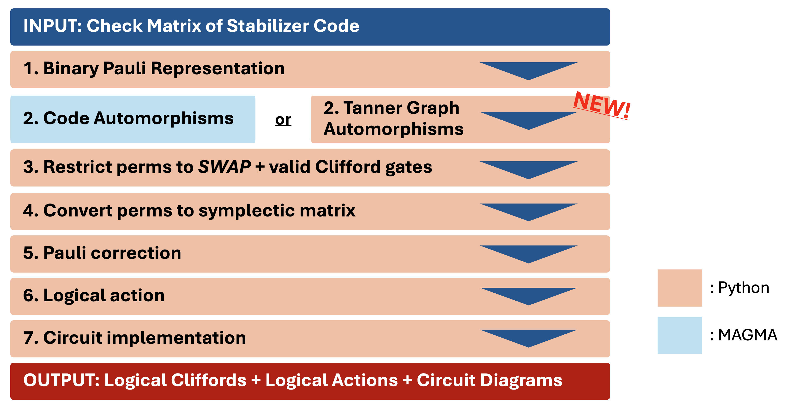

# autqec
autqec (optionally pronounced as 'oat cake') is a Python package for studying fault-tolerant logical Clifford gates on stabilizer quantum error correcting codes based on their symmetries. Given a set of stabilizer generators of a stabilizer code, it maps the stabilizer code to a related binary linear code, computes its automorphism group (using MAGMA software), and imposes constraints based on the Clifford operators permitted. The allowed permutation automorphisms translate to symplectic matrices which are represented as Clifford unitaries in $6$ layers of gates as $H-CNOT-S-CZ-X-C(X,X)$. The software also computes appropriate Pauli corrections to the physical circuits with a particular logical action by considering the destabilizers of the stabilizer code. 

autqec can identify transversal, *SWAP*-transversal and short-depth arbitrary Clifford circuits that preserve the stabilizer group and has non-trivial logical action on the logical qubits. Outline of the algorithms for finding logical Clifford operators via code automorphisms is given below.



## Installation 
Run: `pip install autqec`

## Dependencies (for full functionality)
MAGMA V2.28-8: http://magma.maths.usyd.edu.au/magma/. 

## Citation 
H. Sayginel, S. Koutsioumpas, M. Webster, A. Rajput, and D. E. Browne, Fault-Tolerant Logical Clifford Gates from Code Automorphisms, (2024), arXiv:2409.18175 [quant-ph].

```
@article{autqec_paper,
    author = "Sayginel, Hasan and Koutsioumpas, Stergios and Webster, Mark and Rajput, Abhishek and Browne, Dan E.",
    title = "{Fault-Tolerant Logical Clifford Gates from Code Automorphisms}",
    eprint = "2409.18175",
    archivePrefix = "arXiv",
    journal = "arXiv:2409.18175",
    primaryClass = "quant-ph",
    month = "9",
    year = "2024"
}
```

```
@misc{autqec_code,
    author = {Sayginel, Hasan},
    license = {GPL-3.0},
    month = aug,
    title = {{autqec (Logical Clifford Gates from Code Automorphisms)}},
    howpublished = {\url{https://github.com/hsayginel/autqec}},
    version = {1.0.1},
    year = {2024}
    }
```

## Acknowledgements
This work is supported by various EPSRC grants. 
